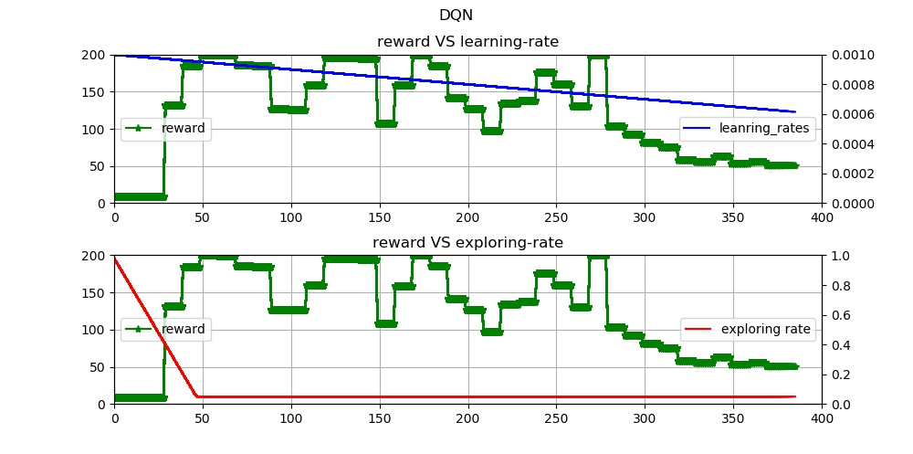

# 实现DQN注意事项

## 关于Target的定义  

双网络架构下，一个网络$M_0$正常训练，另一个$M_1$每一段时间备份权重，提高训练稳定性。双网络架构下$Target(S_0,A_0)$表示状态$S_0$下，动作$A_0$的目标值 $Target(S_0,A_0) = M_0(S_0,A_0)= R_0 + max_{A_i \in A_{all}}{M_1(S_1,A_i)}$

## 关于LOSS函数  

DQN属于Value Iteration方法，采用的是回归模型，所以loss是L2Loss，但提高梯度稳定性，避免梯度突变，可以做梯度裁剪或者采用HuberLoss

## 如何避免模型频繁选择一个模型

$\epsilon -greedy$方法，而且初始训练阶段$\epsilon$比较大，随着训练时间增加$\epsilon$逐渐降低。如此初期随机程度比较大，一段时间后才完全依赖模型

## 实验结果
